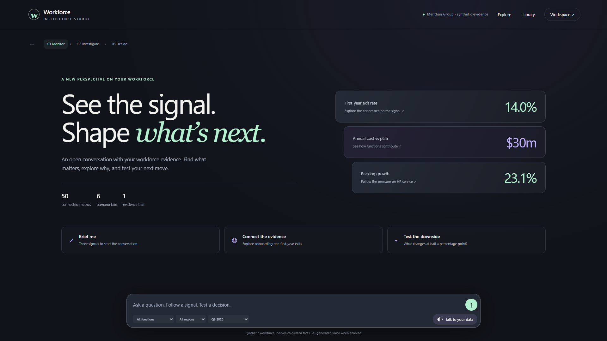

# Workforce Intelligence — synthetic CHRO decision workspace

**The default experience is now Intelligence Studio.** Ask naturally, explore a coordinated evidence canvas, keep assumptions through follow-ups, and save investigations or decision drafts. The original detailed dashboard remains under **Workspace**. See the [Studio guide](docs/STUDIO.md), [browser verification](docs/studio/report.json), and [real-provider voice result](docs/studio-voice/provider-report.json).



A runnable executive demonstration for Monitor → Investigate → Decide. It combines 38 mapped People/HR Operations views, 50 metric inspectors, six transparent scenario labs, a bounded conversation, a synthetic Workday-style report adapter, and a saved decision workspace. Every workforce number belongs to **fictional Meridian Group**. No Workday tenant, payroll, employee record, company identity provider, or production entitlement is connected.

The application implements both turn-based voice and a GPT-Live WebRTC path. OpenAI and optional Claude calls require separate API projects and model access; configuration alone does not verify that they work. The included tests exercise local logic and mock HTTP responses. Real API, microphone, speaker, browser recording, Docker and target-device behavior require their own verification before a presentation.

**Version 2.0.1 fixes voice startup diagnostics.** Network and API failures now return specific, sanitized categories instead of the vague “configuration and saved state” message. Continuous voice includes **Connection help → Check API connection / Download connection report**. It also cleans up a newly allocated session if local audit persistence fails. Browser media tests and a server/API connection test verify different parts of the pipeline. See [docs/VOICE-TROUBLESHOOTING.md](docs/VOICE-TROUBLESHOOTING.md) for updating an existing installation and reporting a failure.

## Start locally

Install Node.js **22.9 or newer**. This build was tested on Node 24.19.0. No npm dependencies or build step are required. From this directory:

```sh
npm start
```

Open **http://127.0.0.1:8787**. The startup script loads `.env` if it exists; with no API key configured it runs the deterministic synthetic demo. `./start.sh` and `start.cmd` provide equivalent launchers. Use the local server, not `public/index.html` directly. State is saved under `.state/` by default.

To set options, copy `.env.example` to `.env` and edit it locally. `.env` and `.state/` are excluded from distributed files. These are server-side values:

| Variable | Purpose |
| --- | --- |
| `OPENAI_API_KEY` | Enables configured Astra routing, transcription, generated speech, and the GPT-Live session path; actual entitlement still needs a live test. |
| `ANTHROPIC_API_KEY` and `ANTHROPIC_MODEL` | Both required for optional Claude review. Leave both blank for a deterministic method review; partial configuration returns an error. |
| `APP_PASSWORD` | Optional on loopback; required when binding to `0.0.0.0`. Minimum 16 characters. This is one shared demo password, not individual identity or enterprise SSO. |
| `PORT`, `BIND_HOST` | Default `8787`, `127.0.0.1`. Only `127.0.0.1`, `::1`, or `0.0.0.0` are accepted. |
| `STATE_DIR` | Directory for saved synthetic report state, decision drafts and bounded audit events. Default `.state`. |
| `PUBLIC_ORIGIN` | Exact external HTTP(S) origin for a reverse proxy. Use HTTPS for remote microphone/WebRTC and secure cookies. |

Your ChatGPT Pro subscription does not supply an API project key or model entitlement. API calls may incur usage charges. Keep keys server-side; do not put real personnel information into this demonstration.

## Walk through the product

1. **Monitor:** start at the enterprise pulse, select a function/region and flow period, then open People or HR Operations. The coverage register maps the documented 38 questions and marks gated or unsupported definitions. A metric inspector shows population, numerator/denominator, definition, period and evidence; small sensitive cells can be withheld.
2. **Investigate:** select the first-year exit signal. The matured cohort is 1,200 hires with 168 first-year exits (14%); inspect delayed onboarding as an association, not a proven cause. Pin a metric to carry its scope and source revision into a decision.
3. **Decide:** compare the retention scenario at the default three-percentage-point assumed improvement, then lower it to 0.5 points. The modeled value changes under fixed population and cost assumptions. The other labs cover capability, AI delivery, leadership continuity, HR service capacity and workforce capacity. Adjust assumptions, capture a version, document dissent, ownership and a stop gate.
4. **Saved decisions:** save the active scenario, reload its server-calculated assumptions and pinned evidence, request a method review, and export a draft or the workspace JSON. A configured Claude model can independently challenge assumptions but cannot alter calculated numbers. Saved records remain **draft-unapproved**; no approval or action system is integrated.
5. **Connections & readiness:** inspect generated report coverage and the current source revision. Refresh the baseline, apply a synthetic correction, restore the baseline, or deliberately reject an invalid batch. A valid refresh updates dashboard views. The diagnostic button requests microphone permission only when clicked and can export a local test WebM and JSON report; its tone is **not** a spoken briefing.
6. **Ask Workforce:** type a representative question or use push-to-talk when API speech is available. Inspect the grounded answer and its facts, then navigate to the related metric or lab. In API mode, the server asks `gpt-6-astra` for a constrained routing plan; local JavaScript calculates the numbers. Browser speech synthesis may preview demo answers. Configured API narration can be played or recorded with the visible evidence card as a narrated WebM if the browser supports canvas/audio capture.
7. **Continuous voice:** with OpenAI API access and a compatible browser, click **Start conversation**. The GPT-Live WebRTC path streams microphone input, plays AI voice, shows approximate transcripts and delegates evidence questions back to the server's governed answer path. Speak to interrupt; stop when finished. Voice duration may accrue while connected, including mute. The actual upstream session and final usage remain unverified until tested with a key.

The visual output is a dashboard and a generated **evidence-card video** with synthesized narration. There is no avatar, camera recording, live camera analysis, or video understanding. Microphone audio is never inserted into exported briefing video. A browser diagnostic tone only checks local audio/video track capture.

Suggested questions: “What is our headcount?”, “Explain E03 for Engineering”, “What is the first-year exit rate?”, “How is the HR service queue changing?”, “What is workforce cost versus plan?”, and “Explain E04” Specific supported scopes can change dashboard filters; unsupported or ambiguous requests are bounded instead of answered with invented facts.

## Synthetic source and revision behavior

Seven generated reports cover HCM, Talent, Payroll, a matured cohort extract, and **separate** synthetic HR service, Finance and listening supplements. They are aggregate function × region × month data, with 240 rows per monthly report and 20 cohort rows. The connector pages, joins, validates and atomically promotes a complete snapshot. The correction changes an Engineering/EMEA goal-submission aggregate; an invalid batch is rejected without replacing the active snapshot. `sourceVersion` is a content digest, not proof of external source provenance. Report details and required production substitutions are in [docs/WORKDAY.md](docs/WORKDAY.md).

The local server persists generated source revisions, saved draft decisions and bounded audit metadata in `STATE_DIR`. It does **not** store microphone recordings or whole conversation transcripts. Decision exports contain synthetic evidence, written notes and saved assumptions. Back up or delete the state directory deliberately; `.state/` is ignored by Git. A source revision change makes stale question/decision saves fail for refresh, and pinned evidence must be repinned against the new revision.

## Validation and deployment

```sh
npm test
npm run preflight
```

The preflight performs local configuration/readiness checks without making paid model requests by default. An explicit `npm run preflight -- --live` calls OpenAI twice for speech, once for transcription and once for Astra routing. Add `--claude` for one configured Claude review. These flags may incur API charges. Use `--output preflight-results.json` to save the results. Each run uses an isolated temporary workspace; it does not modify your saved decisions. See [VALIDATION.md](VALIDATION.md) for the checks actually performed and remaining browser/external gates.

For a local container demonstration, set a real `APP_PASSWORD` of at least 16 characters in an unshared `.env`, then run `docker compose up --build`. The compose file publishes only to host loopback and retains `.state/` in a named volume. The container listens on `0.0.0.0` internally; the password is required. Docker behavior has not been verified in this workspace. For access beyond one machine, put it behind an HTTPS reverse proxy with an exact `PUBLIC_ORIGIN` and appropriate network controls; this shared-password demo does not provide per-user authorization.

Production use requires tenant-approved Workday reports plus separate HRSD, Finance and listening feeds; effective-dated joins, reconciled metric definitions, IAM/SSO, row and field entitlements, retention policy, monitoring, governance and human approval. The Board/CEO/CHRO selector only changes presentation. It grants no access rights. Neither model agreement nor an attractive scenario constitutes evidence of a causal outcome.

The shipped view inventory is in [docs/COVERAGE.md](docs/COVERAGE.md); detailed API and response boundaries are in [CONTRACT.md](CONTRACT.md). No upstream credentials, real employee data, or hardware-browser verification are included.

## API references used for this build

- [GPT-Live and WebRTC](https://developers.openai.com/api/docs/guides/voice-webrtc)
- [GPT-Live delegation](https://developers.openai.com/api/docs/guides/live-delegation)
- [OpenAI transcription](https://developers.openai.com/api/docs/guides/speech-to-text) and [speech generation](https://developers.openai.com/api/docs/guides/text-to-speech)
- [Claude authentication](https://platform.claude.com/docs/en/api/overview), [Messages](https://platform.claude.com/docs/en/api/messages/create) and [structured outputs](https://platform.claude.com/docs/en/build-with-claude/structured-outputs)

## Local continuation: persistent investigations and browser review

The in-place continuation adds an investigation notebook, improves presentation readability and navigation, and introduces reproducible Chromium review. See [docs/INVESTIGATIONS.md](docs/INVESTIGATIONS.md) and [docs/CONTINUATION-REVIEW.md](docs/CONTINUATION-REVIEW.md) for behavior, screenshots, verified checks and remaining limits. Run `npm ci` then `npm run test:browser` for the isolated browser checks. `npm run preview:review` serves a separate synthetic preview on port 8788 without loading `.env` or `.state`.

The subsequent Astra-inspired visual redesign and authorized restarts are documented in [docs/REDESIGN.md](docs/REDESIGN.md). The main configured app is running on port 8787; the separate synthetic preview is on port 8788.

## Google Cloud

See [deployment architecture and operation](docs/DEPLOYMENT-GCP.md). GitHub Actions runs tests and browser review, builds the container and deploys `main` to Cloud Run. Persistent investigations and decisions use private Cloud Storage; passwords and provider keys use Secret Manager. Local `.env` and `.state` remain local and are excluded from Git and the container.
